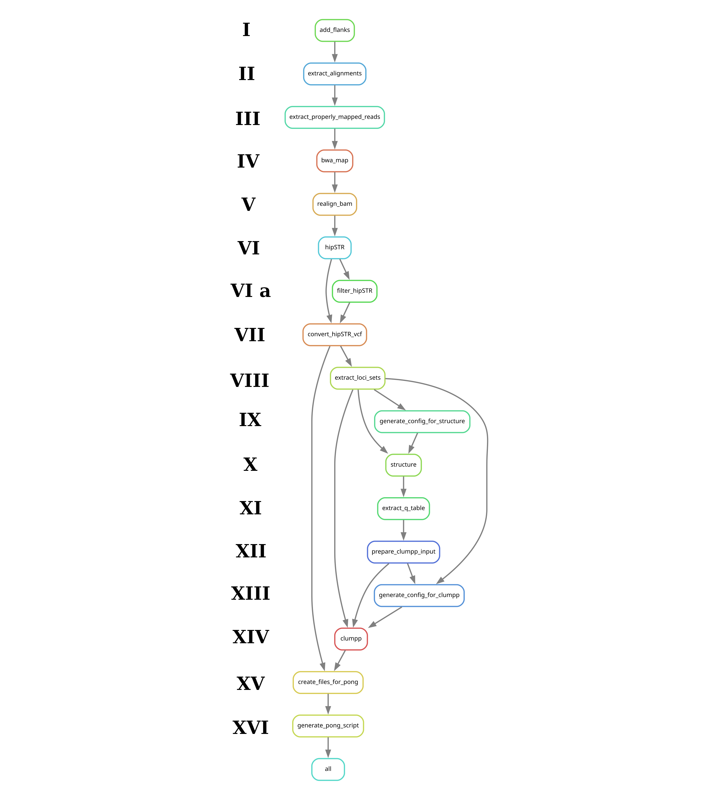

# Snakemake workflow: snakeSTR

Pipeline to perform STR-typing and STR-based admixture analysis.

**NB!** Handling of hemyzigous and haploid markers was not implemented.

# Pipeline description

## I - V. Preprocessing

In the initial stage, for each sample and STR loci, reads aligned to the loci, including flanks of a specified base pair length, are extracted using Samtools. Pairing is verified using Bazam, and reads are then mapped back to the reference genome using BWA and realigned with an indel-aware tool from GATK.

## VI - VII. STR-typing

STR-typing is conducted using hipSTR. The workflow includes analysis of both raw and filtered STR-loci sets. For the raw STR-loci sets, typing is conducted with a set minimum read depth. For the filtered STR-loci sets, additional criteria are applied including minimum read depth, call quality thresholds, and maximum allowable fractions of reads with specific artifacts, alongside biases in allele and strand calls. The workflow is expanded to compare the effects of filtration on the outcome.

## VIII - XIV. Admixture analysis

Admixture analysis is performed using STRUCTURE and Clumpp. The analysis varies the number of clusters (populations), conducting multiple runs for each. The pipeline configuration involves specific options to ensure result robustness.

## XV - XVI. Visualization

Finally, scripts for interactive visualization using Pong are generated to facilitate visualization of clustering results.

# DAG



# Example

```
snakemake --profile profile/slurm/  --configfile config/default.yaml --printshellcmds --latency-wait 30   --config "parameter_set"="default" "reference"="input/reference/mzib.min_150.pseudohap2.1_HiC.purged.fasta" "bam_suffix"=".mzib.hic.purged.mkdup"
```
